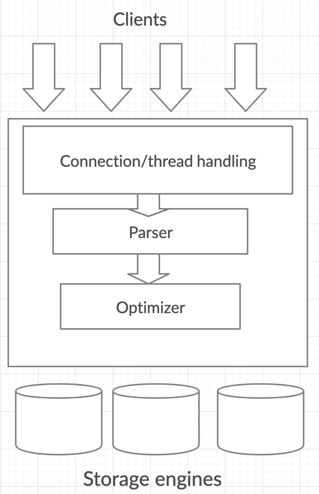
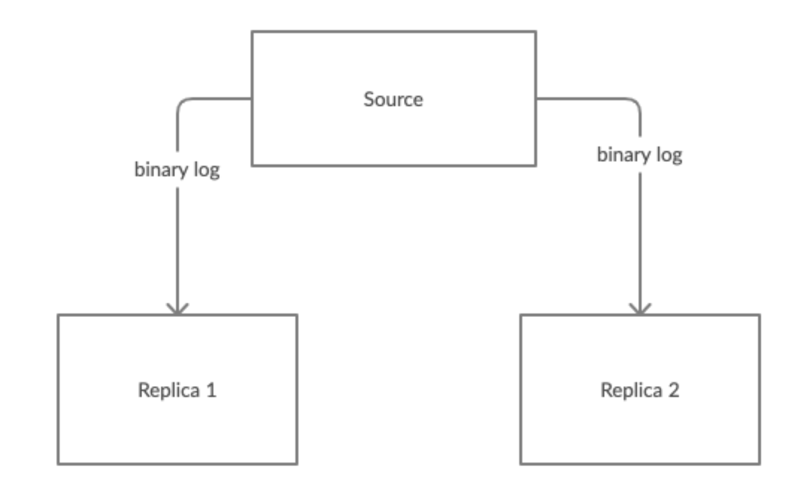
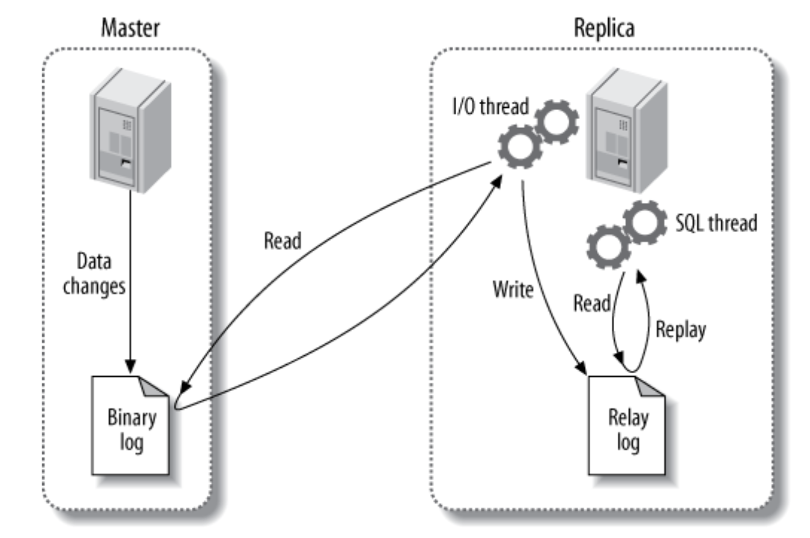

# High Performance Mysql读后感 
- [High Performance Mysql读后感](#high-performance-mysql读后感)
  - [1. Mysql Architecture](#1-mysql-architecture)
    - [Table locks](#table-locks)
    - [Row locks](#row-locks)
    - [事务隔离级别](#事务隔离级别)
    - [Multiversion Concurrency Control (MVCC)](#multiversion-concurrency-control-mvcc)
    - [Replication](#replication)
    - [MySQL's Storage Engines](#mysqls-storage-engines)
    - [Transaction Logging](#transaction-logging)
  - [2. Benchmarking MySQL](#2-benchmarking-mysql)
    - [What To Measure](#what-to-measure)
  - [3. Profiling Server Performance（本次没看）](#3-profiling-server-performance本次没看)
  - [4. Optimizing Schema and Data Type](#4-optimizing-schema-and-data-type)
    - [Data Type](#data-type)
    - [Normalization and Denormalization](#normalization-and-denormalization)
    - [Cache and Summary Table](#cache-and-summary-table)
    - [Counter Tables](#counter-tables)
  - [5. Indexing for High Performmace](#5-indexing-for-high-performmace)
    - [B-Tree Index](#b-tree-index)
      - [B-Tree Index的局限：](#b-tree-index的局限)
  - [6. Query Performace Optimization](#6-query-performace-optimization)
    - [Mysql的优化器](#mysql的优化器)
  - [7. Advanced MySQL Feature（本次不看）](#7-advanced-mysql-feature本次不看)
  - [8. Optimizing Server Settings（本次不看）](#8-optimizing-server-settings本次不看)
  - [9. Operating System and Hardware Optimization（本次不看）](#9-operating-system-and-hardware-optimization本次不看)
  - [10. Replication](#10-replication)
    - [Replication基本架构](#replication基本架构)
    - [使用场景](#使用场景)
  - [11-16本次不看](#11-16本次不看)

## 1. Mysql Architecture

mysql与大多数web service一样，共分为三层：  
client层，Server层和storage engine层。 
Server层是Mysql的核心，提供了SQL语句的分析器和优化器。  
然后，通过Storage Engine API与filesystem（可为不同系统）通信，存储或者取得结果。正因为有了storage engine api不同系统间的filesystem的不同变得透明。（和之前看的HBase架构相同。）  

### Table locks
开销最小的锁。
### Row locks
有很好的的并发性，但是，开销最大。  
在Storage engine层实现，Server层甚至不会意识到row key的存在。
### 事务隔离级别
参看自己整理的另一篇文章mysql-isolation.

### Multiversion Concurrency Control (MVCC)
参看自己整理的另一篇文章mysql-isolation.

### Replication
在mysql中，replication使用pull模式，定时从master通过检索binlog复制需要同步的数据。下图展示了mysql的replication topology.

Mysql一般最少开启三个主从复制（replica），并将replica部署到不同的位置（在云环境中被称作Region，Hbase中的Region也基本同义）。

### MySQL's Storage Engines
熟悉InnoDB即可。
table的row format。redundant的情况下存储定长，compact的情况下存储动态长度。例如：varchar，varbinary，blob和text，在redundant的情况下，无论字符长短均存储用户定义的长度；在compact情况下，只存储实际需要的容量。

### Transaction Logging
Transaction Logging会先在memory上修改in-memory copy of the data，之后，再同步到disk上，这样会大大提高transaction的效率。  
这种技术被称作：write-ahead logging，query会被存储在disk上，即使，Server在将数据更新到disk前宕机，重启后也可以通过write-ahead logging继续操作。（HBase也用了同样的技术）

## 2. Benchmarking MySQL
benchmarking的意思是基准。主要讲MySQL可以处理多少数据量，完成什么量级的任务。个人认为这章非常重要，因为，只有了解了这些，在工作中才可以在最初的设计阶段，评估MySQL是否能处理当前的数据量，提前评估需要的服务器数量等等。

### What To Measure
1. Throughput(吞吐量)  
   一般通过transaction per second进行测量。
2. Response time or latency  
   一般，测量百分位(percentile)的response time。例如：95th percentile的response time为5ms，就表明至少95%的请求的response time都小于5ms。  

数据分析：例如相同的response time的情况下，系统每秒可以处理更多的transaction。这代表吞吐量增加了。（控制变量法？）

## 3. Profiling Server Performance（本次没看）

## 4. Optimizing Schema and Data Type
### Data Type
* varchar: 是变长字符串。会用2byte存字符串长度。所以varchar(1000)实质占用1002byte的空间。
* char: 为定长，不怎么用
* enum: 存储字符串的枚举类型。在数据库内部，会以integer进行存储。  
  另外需要注意，枚举类型最好不要修改，因为，会触发copy table。如果，一定要修改，最好只在enum list的最后进行追加，并且不改变存储的容量，这样才使用的是instant算法。  
  延伸：Alert Table处理table，一般有三种算法，copy，inplace饿instant。  
  copy会逐行复制表的数据，因此，不能同时执行其他dml。  
  inplace会rebuild部分表的结构，在准备和执行阶段，会简短地加锁。  
  instant只修改metadata，而且，无锁也不修改表内的数据，因此，可以并发其他dml。

### Normalization and Denormalization
In a normalized database, each fact is represented once and only once.   
In a denormalized database, information is duplicated, or stored in multiple places.

normalized schema的缺点，需要更多的检索，往往检索，最少需要一次join。

denormalized schema的数据都在一个表内，因此，在某些特定情况下，可以减少检索成本。  
本次Novelty开发的campaign_pattern_item部分，就是最好的例子。将type，discount_rate，discount_threshold，写在了一个表里。虽然会发生数据重复，但是，大大提高了检索效率和开发难易度。

### Cache and Summary Table
让我想到了Insight。元数据太大，因此，将aggregate后的数据存储在其他地方(summary table or cache table)，然后，展示的时候并不从元数据表里拿数据，而是，从summary table中直接拿统计好的数据，如果summary table的数据不够用，可以再加工后展示出来。  
不过这种方法有个问题，如果需要考虑数据同步，则非常麻烦。不过目前Insight没有这个问题，因为，元数据和summary table的数据并不需要双向同步。

### Counter Tables
可以专门独立出一张表用于记录计数的履历，这样就不会对某一条数据进行累加计数，也就不存在为了保证计数的正确性，而对某一行数据进行加锁了。

## 5. Indexing for High Performmace
（可以简单看下。便于理解下一章的Mysql自动优化）
### B-Tree Index
关于B-Tree可以看这篇文章：
https://blog.csdn.net/yin767833376/article/details/81511377  
B+Tree可以看这篇文章：
https://database.51cto.com/art/201907/598949.htm  
根据以上两个文章，再结合书里的图和说明，基本可以理解B-Tree index的原理和限制。
#### B-Tree Index的局限：
最主要的一点就是，最左原则，搜索的条件一定要符合最左原则才能让mysql使用index进行查询。

关于本章的其他内容，可在工作中需要优化Index的时候再读。

## 6. Query Performace Optimization
看了一半实在看不下去了。感觉以后工作中需要对数据库的查询进行优化的时候，再看这章内容比较合适。主要记住以下几点，感觉已经够处理多数问题了。

在优化Query时考虑以下几个问题：
1. 是否select了不需要的行
2. 是否select了不需要的列。尤其，在join table的时候，如果使用 `select *` 会将其他表的所有列也一同取得。
3. CHOPPING UP A QUERY: 一次性插入10万条数据，会对数据库造成压力，所以可以分5000条一次进行插入。
4. JOIN DECOMPOSITION: 尽量避免在Query中使用join。可以在app一侧map数据。在公司项目中感受比较深的是，不使用join可以分离database，并部署到不同server上。防止次要table的过载，造成master table的宕机。

### Mysql的优化器
基本知道mysql的优化器会帮我们处理多数查询，所以，无需特意写一些奇怪的query就可以。  
1. Subquery optimization: 可以自动优化子查询，使其可以使用index。
2. Join optimizer: mysql会优化join的顺序，执行性能最优的后选项。还可以将outer join 转化为 inner join。
3. Sort optimizations

## 7. Advanced MySQL Feature（本次不看）

## 8. Optimizing Server Settings（本次不看）

## 9. Operating System and Hardware Optimization（本次不看）

## 10. Replication
简单来说就是一台master，附属了多台replica服务器。每台replica服务器会请求master的binary log，通过binary log将master的数据同步到replica上。  
基本上是一台master（写入）和多台replica（读出）的组合。因为，多台写入的话，很难实现数据同步。多台replica同步master数据时也有可能出现延迟（在工作中也遇到过，所以才使用@Master，指定直接去master取数据）。  
延迟主要取决于throughput，一般超过5000/s的写入就会造成延迟。另外，单个事务的大小也会影响延迟，例如一次插入10万行的数据（工作中也遇到同样的问题，因此，一个事务一般只插入1000条左右的数据，超过的情况会拆开，分多个事务插入）。

### Replication基本架构

### 使用场景
目前接触过的场景有两种：  
1. replica完全复制master的数据，实现读写分离。降低master的负载。
2. 另一种是replica复制一部分master的数据，特定数据去特定的replica取。（在使用elastic search的时候也遇到过类似的场景，根据id的奇数偶数进行分离，通过id的取余计算，分发请求。）

## 11-16本次不看
