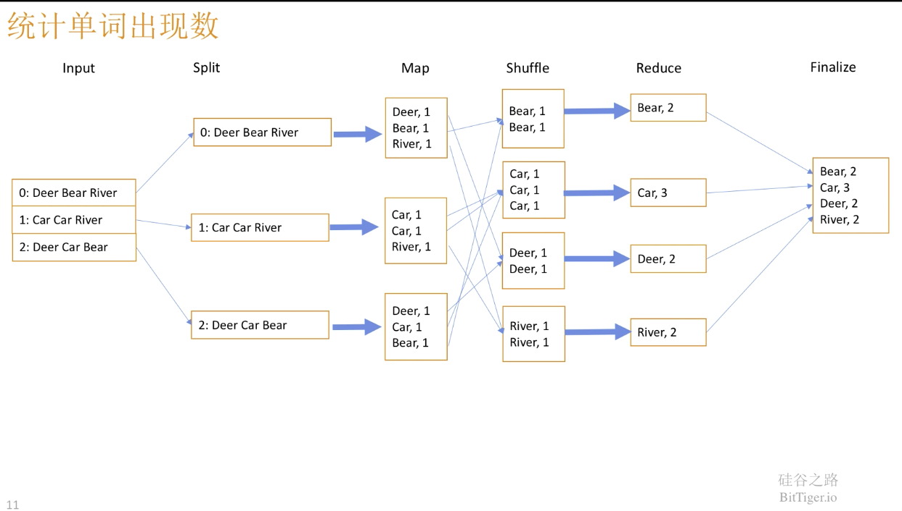

# MapReduce详解
## Mapreduced的基本概念
mapreduce实质是分治算法。map负责拆分，reduce负责合并。  
  
split: 负责将数据块切分成数个文件。  
map: 负责对单个文件中的内容切分。  
shuffle: 对map处理后的结果处理排序。
reduce: 将处理后的数据进行整合。

视频解说：  
https://www.bilibili.com/video/BV1Vb411m7go?from=search&seid=8612635328851946181

## Skewed Join
MapReduce并不擅长处理分布不均匀的数据，因为，无法有效的进行并行处理。  
例如：  
A表有id列，有10条数据，该10条数据中9条id字段为1，1条为2。  
B表有id列，有10条数据，该10条数据为从1到10。  
如果A，B进行join，则会很缓慢，因为，除处理1以外的reducer都要等待，处理1的reducer完成才能继续工作。

因此，可以将与1有关的数据和与1无关的数据分开处理。  
与1无关的数据分布均匀，因此，可以高效的并行完成工作。
与1有关的数据，可以将join操作在map过程中完成，而不是传递数据到reduce的过程后再完成。  
这样可以解决，其他reduce等待与1有关的reduce的瓶颈。

原理解说：  
https://cwiki.apache.org/confluence/display/Hive/Skewed+Join+Optimization  
hive的设定：
https://learning.oreilly.com/library/view/apache-hive-cookbook/9781782161080/ch07s08.html#ch07lvl2sec175
