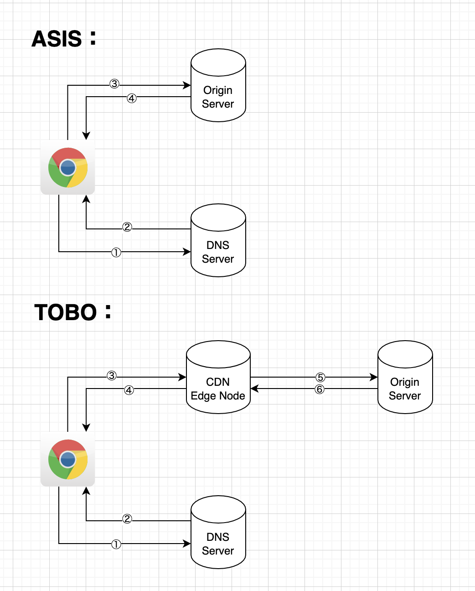

# CDN(Content Delivery Network)
CDN全称为内容分发网络，其本质就是一个大型的缓存系统。  
CDN主要解决以下2个问题：
* 加快响应速度
* 减少服务器压力

如下图ASIS为无CDN架构:  
①browser通过网址，访问DNS服务器  
②DNS服务器返回origin server的实际的ip地址  
③browser通过返回的实际ip地址访问origin server  

这会带来两个很显著的问题：  
1. 如果用户在中国，origin server在美国，那么响应速度一定会很慢。
2. 用户直接访问origin server，如果，请求过多origin server可能会直接宕机。

  
如上图TOBE为有CDN架构：  
①browser通过网址，访问DNS服务器  
②DNS服务器返回origin server的cname地址（cname地址实质就是cdn服务器的地址，例如：cache.cdn-example.com）
③browser通过cname地址访问cdn服务器，cdn服务器会将请求自动转发给最近的cdn服务器。
④cdn服务器会将缓存的信息返回给用户。

⑤cdn服务器会根据缓存的ttl，自动从origin server拉取新数据，更新原有数据。

可以看到browser不在直接访问origin server，而是访问cdn服务器。  
而cdn服务器又会分散部署在各个国家，browser的请求会根据用户的位置，自动分配给就近的cdn服务器进行处理，因此，可以有效的解决由于距离过远而造成的响应时间过程的问题。  

同时，browser不再直接访问origin server，而是访问cdn的缓存服务器，因此，origin server的负担会大大降低。

## 工作中的实际使用
### 减少响应时间
服务器在东京，但是，用户主要在印尼，泰国和台湾。  
因此，用户访问服务器的响应时间较长。  
加入akamai的cdn后，响应时间大大减少。

### 操作界面
没有实际配过，但是，估计和dns的配置页面类似。  
主要配以下内容：
* cname: dns处会将自己服务器的domain和该cname配对。实质就是自己服务器和cdn服务器的mapping。
* domain name: CDN供应商提供的domain
* origin: 原始服务器domain
