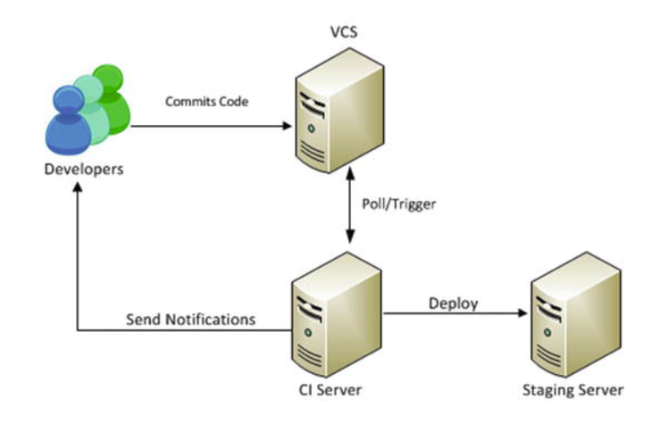

# Gradle
- [Gradle](#gradle)
  - [1. Understanding Gradle Builds](#1-understanding-gradle-builds)
    - [1.1 Projects](#11-projects)
    - [1.2 Task](#12-task)
    - [1.3 Build Lifecycle](#13-build-lifecycle)
  - [2. Plugin](#2-plugin)
    - [Extension](#extension)
    - [工作中遇见的Best Practice](#工作中遇见的best-practice)
  - [3. Dependency](#3-dependency)
  - [4. Multi-Project Build](#4-multi-project-build)
  - [5. Continuous Integration](#5-continuous-integration)
  - [6. Reference](#6-reference)

## 1. Understanding Gradle Builds
Gradle有两种build模块，Projects和Tasks
### 1.1 Projects
project在gradle文件中会被直接关联。因此，可以通过前缀project.xxx或者直接xxx调取其属性。  
例如: project.name或者name均可。
### 1.2 Task
* 基本可以理解成方法。可以声明task间的依赖关系。
    ```
    tasks.register("hello") {
        doLast {
            println("Hello world!")
        }
    }
    tasks.register("intro") {
        dependsOn("hello")
        doLast {
            println("I'm Gradle")
        }
    }
    ```
    通过gradle intro 可以调用intro task。
    ```
    > gradle -q intro
    Hello world!
    I'm Gradle
    ```
* 定位task  
  可以通过tasks.named("name")或者tasks.withType<Type>()获取指定type。

### 1.3 Build Lifecycle
Gradle的build生命周期分为3个阶段：  
* Initialization phase: 扫描project中所有的gradle文件，并生成project实例。
* Configuration phase: 配置所有的task，包含跳过task
* Execution phase: 执行所有task


## 2. Plugin
在Gradle中，Plugin是指可重用的build, task configuration的逻辑。
### Extension
Plugin一般都会有extension，该extension用于自定义plugin。  
例如：
```
open class GreetingPluginExtension {
    var message: String? = null
    var greeter: String? = null
}

class GreetingPlugin : Plugin<Project> {
    override fun apply(project: Project) {
        val extension = project.extensions.create<GreetingPluginExtension>("greeting")
        project.task("hello") {
            doLast {
                println("${extension.message} from ${extension.greeter}")
            }
        }
    }
}

apply<GreetingPlugin>()

// Configure the extension using a DSL block
configure<GreetingPluginExtension> {
    message = "Hi"
    greeter = "Gradle"
}
```
使用以上的plugin中的hello task可以生成以下输出：
```
> gradle -q hello
Hi from Gradle
```

### 工作中遇见的Best Practice
将project的dependency做成report输出。每次dependency发生变化的时候，CI强制要求更新该文件。这样可以第一时间知道dependency的变化。放生冲突或者不需要的dependency的时候，可以及时exclude掉。

## 3. Dependency
* Internal repository manager: 中介于远程数据仓库，和内部网络的一个依赖管理工具。  
可以理解缓存远程仓库，供内部使用的依赖仓库。  
* buildscript {} 用于使用第三方的plugin
* resolutionStrategy {} 用于定义依赖的各种策略，例如依赖发生冲突的时候需要如何处理等

## 4. Multi-Project Build
* settings.gradle用于定义root项目和子项目  
* allprojects{} 用于对所有项目进行相同的配置  
  例如：
  ```
  allprojects {
      group = "com.apress.gradle"
      version = "1.0.0-SNAPSHOT"
  }
  ```  
  为所有的子项目定义相同的group和version。
  subprojects类似

## 5. Continuous Integration
下图反映了基本的CI架构。  
以公司使用的技术作为的例子进行说明的话，  
VCS使用的是GitHub Enterprise，CI Server用的是Jenkins，Staging Server为Verda。  
平时开发完成，向GitHub推送自己的代码，并且，创建pull request。  
此时，GitHub收到pull request，并将代码发送给Jenkins。  
Jenkins自动build代码，无论成功还是失败，都将结果通过slack通知到对应的channel。  
如果Jenkins自动Build成功，则会将生成的包通过PMC发送到Verda，并部署。
  

通过Jenkins的post-build action可以发布Junit的test result。

## 6. Reference
Introducing Gradle
Offical Document from gradle