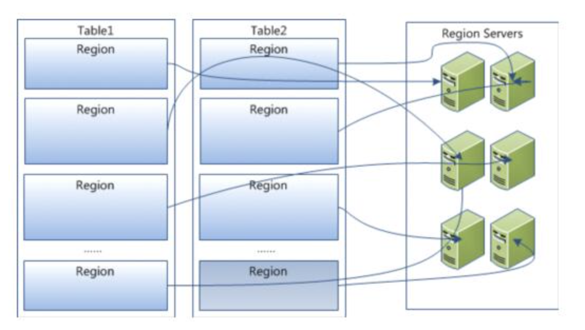
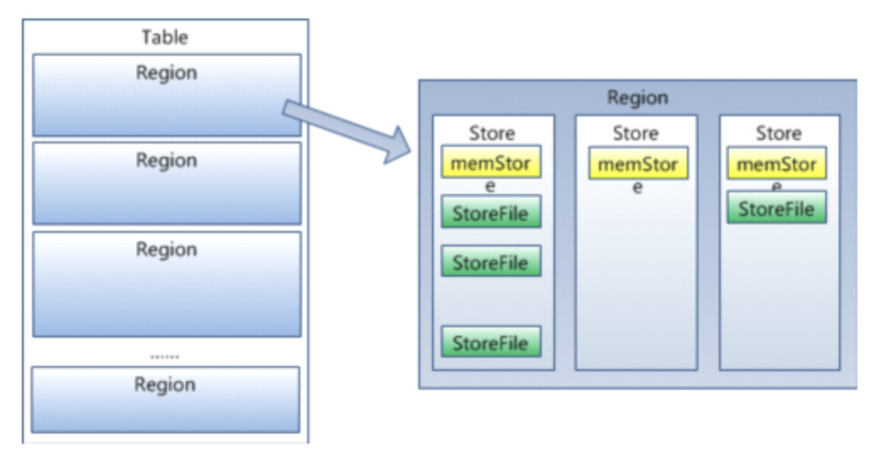

# HBase Archtecture
- [HBase Archtecture](#hbase-archtecture)
  - [Architecture](#architecture)
  - [Compression](#compression)
    - [Block Compressors](#block-compressors)
    - [Data Block Encoding Types](#data-block-encoding-types)
  - [MEMO](#memo)
## Architecture
1. youtube video: https://youtu.be/VRD775iqAko
  这个视频解释的非常好理解
2. 文章内容： http://www.uml.org.cn/bigdata/201810181.asp
  更加详细的内容可以通过该文章理解

HBase之所以是分布式的，因为，他的一个table会被分成多个Region，每个Region又会被分配到多个不同的RegionServer中。

一个Region由多个Store组成，一个Store由一个menstore和多个storefile组成。  
每个store代表一个Column Family。数据的压缩，优化等都是以Column Family为单位进行的。
menstore存于内存，达到阈值后会将数据存入storefile。storefile底层是以hfile格式保存的。

HFile的结构如下所示。HBase的最小IO单元是Data Block。  
Data Block除用于安全检测magic外，是由key-value值拼接而成。

## Compression
### Block Compressors
* none
* Snappy: 与LZO的压缩率相近，但是，有更好的性能。
* LZO
* LZ4
* GZ: 消耗更多的cpu，但是，有更好的压缩率

### Data Block Encoding Types
* prefix  
  与前一行比较，key中重复的部分可以不被存储。  
  例如：  
  RowKey:Family:Qualifier0  
  RowKey:Family:Qualifier1  
  只会存储：  
  RowKey:Family:Qualifier0  
  1  
* diff
  prefix的拓展，与前一行比较，除了key以外，key len, value len, timestamp, type如果和前一行一样，都不会被存储。
* fast diff
  和diff实现基本一样，加入一个新的field，用于判断row是不是完全一样，一样的话，data本身不被存储。
* prefix tree

hot data推荐使用Snappy，因为，消耗的性能少。  
cold data推荐使用GZ，因为，压缩比高。  
默认情况下，推荐开启Snappy压缩。  

key较长，column多的情况下，使用fast_diff

## MEMO
1. HBase适合少写多读的业务需求。
2. 设计时应该尽量减少Column Family的数量。不同的Column Family会被分割到不同的Store中，因此，同一个rowkey中的数据若存储在两个不同的CF中，在检索一行时就会检索所有的两个HFile，这会增加检索的成本。（HBase In Action4.1.4）
3. 在Get检索时，可以通过限制RowKey，Column Family和Timestamp来缩小HFile的范围。Column Qualifier不能够缩小检索的HFile的范围，但是，可以减少返回的结果数量，以降低Client或者网络成本。
4. 应当尽量在一次检索请求中涵盖所有的数据结果，而不是通过多次请求获得所需的数据结果。因为，HBase不支持跨行事务，应当尽量避免在Client组建自己含有事务的代码逻辑。
5. 每一个RegionServer的Region应该尽量控制在100以内。（官方文档）
6. 长表(tall table)性能优于宽表(wide table)。（HBase In Action4.1.3）
7. hot-spot是指对某一区域的数据进行频繁访问，因而造成某一区域容易过载。例如，将timestamp作为rowkey进行存储，多数情况都是对最近的数据感兴趣，因此，hbase的底部Region就会被频繁访问，造成过载。但是，如果将timestamp转换为hashkey或者md5再作为rowkey，则可将数据均匀的存储在不同的Region。起到良好的负载均衡作用。（HBase In Action4.1.3）