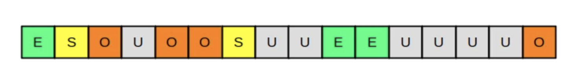

# JVM G1 Garbage Collector
## 看这部分工作就够用
### Java7之前的GC机制(CMS:Concurrent Sweep Collector)
JVM的垃圾回收机制一般将heap分为3个部分。
* Eden Space
* Survivor Space
* Old Generation
  
Eden Space和Survivor Space也可被称为Young Generation。  
因为，所有的对象最初被分配内存时，首先会分配给Eden Space。  
然后，在第一次垃圾回收后，不被使用的对象会被移入Survivor Space。  
最后，数次垃圾回收周期后仍旧幸存的对象，会被移入Old Generation。

CMS的缺点：
* 进行垃圾回收时必须要对整个heap进行扫描，app必须挂起，因此，并发性不好。

### Java7之后的GC机制(G1: Garbage First Collector)
  
Java7之后引入G1机制，该机制将heap分成多个region。  
每个region都可以是eden space, survivor space, old gen。  
在扫描时，G1并不是对整个heap进行扫描，而是，选择1组region进行扫描。  
存活的object会被复制到unsigned region，而后，unsigned region会被标记为相应的space。  
可以看出G1机制不是对整个heap进行扫描，  
因此，app无需长时间挂起(未被扫描的region仍然可被使用)

## Reference
https://www.dynatrace.com/news/blog/understanding-g1-garbage-collector-java-9/