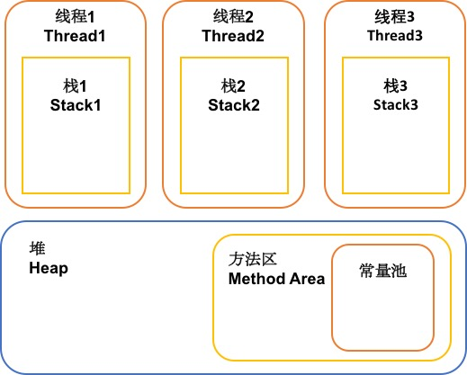

# JVM内存分析
**keywords: JVM，Java虚拟机，内存分析，JVM分区**  

## 数据类型（Data Types）
Java虚拟机内数据类型分两种：

* 基本类型（Primitive Types）：包括用关键字声明的byte，int，char，float等。
* 引用类型（Reference Types）：包括对象，数组，接口三种类型。

简单来说，Java虚拟机中基本类型全为数字类型（Numeric type）且为定长，而引用类型的大小由虚拟机动态分配。

## 运行时数据区（Run-Time Data Areas）
Java虚拟机涉及以下几个分区，列表的分层变现了各区域在Java虚拟机中的包含关系。  

* 程序计数器（The pc Register）
* Java虚拟机栈（Java Virtual Machine Stacks）
* 堆（Heap）
  + 方法区（Method Area）
    - 常量池（Run-Time Constant Pool）
* 原生方法栈（Native Method Stacks）  

本文只进行序列中2，3两部分的分析，即Java虚拟机栈和堆，下文Java虚拟机栈简称为栈。JVM的运行时分区的结构如下图所示：



### 栈
在Java虚拟机中，每一个线程都有自己独立的栈，用于存储帧（Frame）。简单来说，可以将java虚拟机栈理解成传统语言的栈，用于存储局部变量，以及中间的计算过程。
需要注意的是，栈中只存储对象的引用，实际的对象实例存储于堆中。栈中的变量的生命周期与调用方法相同，方法结束后，栈中变量将被立即释放。

### 堆
在Java虚拟机中，所有的线程都共享一个堆，每一个虚拟机有自己独立的堆。堆用于存储对象的实例，以及数组。堆中不再使用的数据，由垃圾回收机制（Garage-collector）自动释放。

### 方法区
方法区实际为堆的一块逻辑分区，用于存储编译后的代码，类的信息，方法的信息等。

### 常量池
常量池从方法区分配空间，用于管理**每一个类或者接口**的常量，其中包括数字以及其他类的符号引用。在编译期间可以确定的类型会被提前放入常量池，以提高效率。另外，Java基础类型的包装类（除float和double）以及字符串都实现了常量池。

```
public static void main(String[] args) {
	String hello1 = "hello";
	String hello2 = new String("Hello");
	String hel = "hel";
	String lo = "lo";

	System.out.println(hello1 == "hello"); //true
	System.out.println(hello2 == "hello"); //false
	System.out.println("hel" + "lo" == "hello"); //true
	System.out.println(hel + lo == "hello"); //false
}
```

上述代码，编译期间既可以确定`“hello”，“hel”，”lo“`，因此以上字符串常量被放入常量池。变量`hello1, hel, lo`都直接通过常量池获得初始值，而`hello2`是通过关键字`new`初始化，因此，值新建于堆，而非来源于常量池中。  
因此，`hello1 == "hello"`为`true`，`hello2 == "hello"`为`false`。  
由于`hel + lo == "hello"`为变量相加，在编译期间无法确定类型，且运行期间Java虚拟机会开辟一个新的临时空间存储`hel`和`lo`的运算结果，因此，`hel + lo == "hello"`为`false`，`"hel" + "lo" == "hello"`为`true`。  

## 堆与栈中数据的存储及释放过程
可参考网页很多不再赘述。参考网页：http://blog.csdn.net/shimiso/article/details/8595564

## 参考
[1] Java Virtual Machine Specification, Chapter2: https://docs.oracle.com/javase/specs/jvms/se8/html/jvms-2.html#jvms-2.5  
[2] Java内存分配研究：http://www.blogjava.net/Jack2007/archive/2008/05/21/202018.html  
