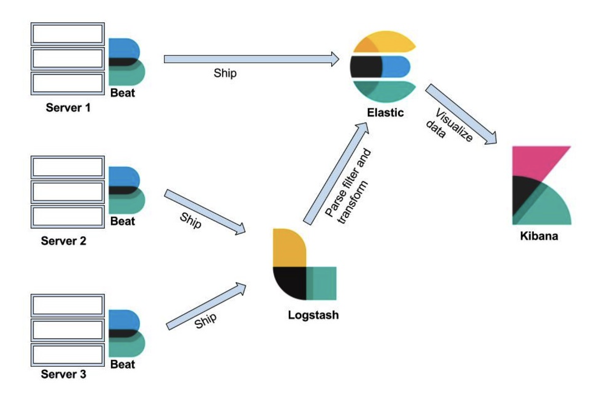

# Elastic Stack: Kibana
## Architecture

* Logstash  
  logstash是data pipline，简单来说是将一处的input数据进行一系列的处理，然后，output到另一处。  
  可以想一下insight的后端实现，也可被称之为insight pipline。因为，该功能基本是将IU处统计的数据转存到自己服务器的Hbase中。
* Beat是data shipper，就是实现一个功能，将服务器上的数据传输给logstash或者elastic search。  
  例如：filebeat可以用于监控服务器上的Apache access log文件，一旦文件发生任何变化，beat就会将数据传输给logstash或者elastic search。  
  分布式的系统，往往一个应用的日志文件会散落在不同的服务上，filebeat可以将这些分散的文件变化发送到libbeat，libbeat会将它们整合后再次发给其他服务。
  logstash也可以在配置中执行input source达到相同的目的，但是，由于logstash主要功能是data pipline，所以，在做传输的时候，多数需要优化。

## Elastic Stack的常用use case
1. Log Management：存入Elastic Search，用Kibana进行查询。
2. Data visualization: 用kibana展示

## Exploring Data by Kibana
### Using the search bar to search your data
```
key: value and key: value or key: value
```
通过上述方式可以对日志进行检索。key为filed，value为想查询的关键字。

## Visualizing Data
可以根据Elastic Search进行聚合统计，然后将统计结果可视化。  
例如：将统计结果可视化为pie chart, heatmap chart, line chart等等。  

个人感想：
* 该部分在看过Elastic Search后，可以再返回回来看一遍。
* 可以稍微整理下各类图表的使用场景。图表只是呈现数据的工具，因此，充分理解工具的使用场景，并将之为自己所用，非常的重要。

## Kibana 7 Quick Start Guide观后感
读后感觉最重要的三节分别是：
* 第一章 Introducing Kibana：介绍Elastic Stack的整体架构。
* 第三章 Exploring Data：主要讲解Kibana在日志管理方面的使用。
* 第四章 Visualizing Data：主要讲解Kibana在数据可视化方面的使用。