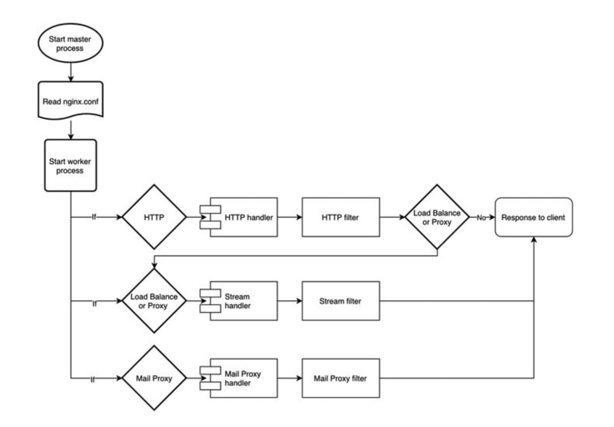
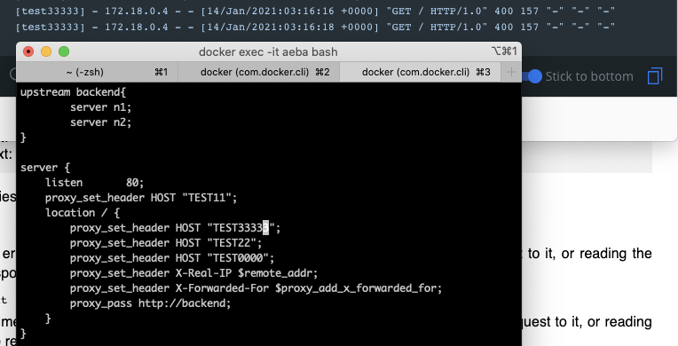

# Nginx
**keywords: nginx，load balancing**  
- [Nginx](#nginx)
  - [1. Nginx默认文件目录](#1-nginx默认文件目录)
  - [2. 常用的Context Block](#2-常用的context-block)
    - [2.1 HTTP Context](#21-http-context)
    - [2.2 Server Context](#22-server-context)
    - [2.3 Location Context](#23-location-context)
  - [3. 常见指令实例](#3-常见指令实例)
    - [3.1 Basic](#31-basic)
    - [3.2 HTTP Load Balancing](#32-http-load-balancing)
  - [4. Module](#4-module)
    - [4.1 Module的工作流程](#41-module的工作流程)
  - [5. Nginx的架构特点](#5-nginx的架构特点)
  - [6. 关于处理Dynamic Content和Load Balancing](#6-关于处理dynamic-content和load-balancing)
    - [6.1 Dynamic Content](#61-dynamic-content)
    - [6.2 高可信度服务三个要点](#62-高可信度服务三个要点)
    - [6.3 Load Balance中常用指令](#63-load-balance中常用指令)
  - [Other](#other)
    - [关于设置的重载(Configuration Override Rule)](#关于设置的重载configuration-override-rule)
  - [7. Reference](#7-reference)

## 1. Nginx默认文件目录
* /etc/nginx: NGINX默认目录
* /etc/nginx/nginx.conf: NGINX的默认配置文件。应用与全局。  
  查询当前NGINX所使用的配置
    ```
    ps -ax | grep nginx

    nginx: master process /usr/sbin/nginx -c /etc/nginx/nginx.conf
    nginx: worker process
    ```
    -c 之后显示的就是当前使用的配置文件
* /etc/nginx/conf.d/" NGINX的HTTP Server的默认配置文件夹。内部包含默认配置文件，该文件夹下的所有文件都会被/etc/nginx/nginx.conf引入。
* /var/log/nginx: 默认日志目录


## 2. 常用的Context Block
### 2.1 HTTP Context

### 2.2 Server Context
可以定义多个Virtual Server。  
NGINX会自动将最匹配的request分配个对应Server块进行处理。  
Routing Rule:  
1. 匹配ip和port
2. 匹配server_name
3. 匹配 `* + server_name`
4. 匹配 `server_name + *`
5. 匹配default_server
6. 返回第一个Server Block

### 2.3 Location Context
子Block可以覆盖父Block中相同的设置。
每个request分配到对应的Block，如果子Block覆盖了父Block的设置，那么，应用子Block的设置，否则，沿用父Block的设置。

## 3. 常见指令实例
### 3.1 Basic
```
server {
    listen 80 default_server; 
    server_name www.example.com; 

    location / {
        root /usr/share/nginx/html;
        # alias /usr/share/nginx/html;
        index index.html index.htm;
    }
}
```
* Server Block用于定义NGINX需要进行监听的服务。
* 其中listen用于指明NGINX需要监听的端口。

### 3.2 HTTP Load Balancing
```
upstream backend {
    server 10.10.12.45:80;
}
server {
    location / {
        proxy_pass http://backend;
    }
}
```
* Upstream Module用于定义一组pool of destinations，可以用于请求转发/负载均衡
* location以及proxy_pass指明所有的请求都会被转发给backend目的地。  
  location ~* 大小写敏感的正则表达式配置，location ~ 大小写不敏感的正则表达式配置

## 4. Module
Module是Nginx中独立的提供特定功能的代码集合。主要包含各种指令。
### 4.1 Module的工作流程
Here are the steps in which a request is processed in Nginx (Figure 4-2 illustrates this graphically):  
1. Start Nginx web server.
2. Nginx master process gets initiated.
3. Read nginx.conf.
4. Creates worker process(es), memory allocation , and other architectural specific configuration as per the CPU architecture.
5. Based on the context like HTTP, MAIL, and STREAM, it creates a list of module handlers and maps them as per their location in the nginx.conf.
6. If a request is http://​abc.​com, the request is processed in http context.
7. It will check for the content module handler need to process the request and the respective handler grabs the request and starts working on it.
8. Once the request is processed, the output is handed over to the filters like gzip, headers, rewrite, etc. The filters will manipulate the output further depending on their order of execution.
9. If there is any load balancer or proxy module, the respective module will further handle the output.  
10. Finally, the response is sent over to the client.  



## 5. Nginx的架构特点
Nginx可以同时处理成百甚至上千的请求。这得益于Nginx的non-blocking模式。
接收到的请求会被创建为socket，然后，迅速被其他线程同时处理。
这与其他的同步服务器相比，大大增加了其处理高并发请求的能力。

REF: 具体参见Nginx: From  Beginner to Pro第五章

## 6. 关于处理Dynamic Content和Load Balancing
### 6.1 Dynamic Content
Nginx并不直接host动态内容，而是，将请求转发给相应的component进行处理。  
这样处理速度较慢的动态页面请求并不会直接影响Nginx，使得Nginx可以最大化发挥其性能。

### 6.2 高可信度服务三个要点
1. 多台服务器步数。非单个服务器部署，即使，是多线程单个服务器也不推荐。
2. Reliable failover。一台服务器down，其他服务器迅速接替他的位置。
3. 错误侦查

### 6.3 Load Balance中常用指令
```
location / {
        proxy_set_header HOST $proxy_host;
        proxy_set_header X-Real-IP $remote_addr;
        proxy_set_header X-Forwarded-For $proxy_add_x_forwarded_for;
        proxy_pass http://backend;
    }
```
* $proxy_host: domain的值或者request header中HOST的值
* $remote_addr: client ip的值或者request header中X-Real-IP的值
* $proxy_add_x_forwarded_for:   
  该request被转发的过的主机的列表。通过逗号分隔。  
  request header中X-Forwarded-For的值，若此值为空则使用\$remote_addr

## Other
### 关于设置的重载(Configuration Override Rule)
* 最内侧的Context的设置会覆盖外侧。
* 同级的设置只有第一个会生效  
  

## 7. Reference
* Nginx: From  Beginner to Pro
* NGINX Cookbook
* http请求头中的X-Forwarded-For: https://imququ.com/post/x-forwarded-for-header-in-http.html