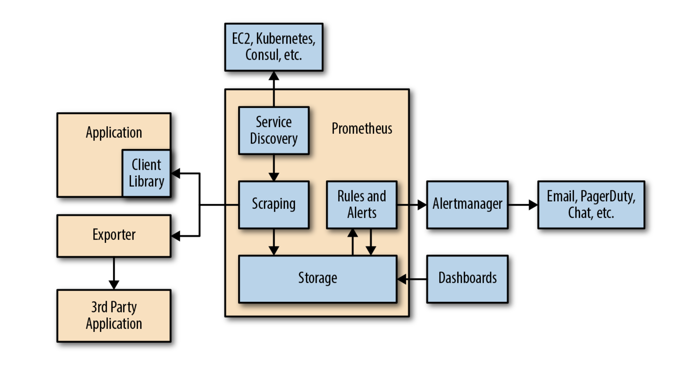

# Prometheus
- [Prometheus](#prometheus)
  - [1. Architecture](#1-architecture)
    - [1.1 Client Library](#11-client-library)
    - [1.2 Exporter](#12-exporter)
    - [1.3 Service Discovery](#13-service-discovery)
    - [1.4 Scraping](#14-scraping)
    - [1.5 不适合场景](#15-不适合场景)
    - [1.6 prometheus的输出格式](#16-prometheus的输出格式)
    - [1.7 其他](#17-其他)
  - [2. Metric](#2-metric)
    - [2.1 Counter](#21-counter)
    - [2.2 Gauge](#22-gauge)
    - [2.3 Summary](#23-summary)
    - [2.4 命名规则](#24-命名规则)
  - [3. 不同类型的Service需要关注的metrics](#3-不同类型的service需要关注的metrics)
    - [3.1 onlie-serving systems](#31-onlie-serving-systems)
    - [3.2 offline-serving systems](#32-offline-serving-systems)
    - [3.3 batch jobs](#33-batch-jobs)
  - [4. Grafana](#4-grafana)
  - [5. PromQL](#5-promql)
    - [5.1 rate](#51-rate)
    - [5.2 Vector matching](#52-vector-matching)
    - [5.3 selector](#53-selector)
    - [5.4 quantile](#54-quantile)
  - [6. Alert](#6-alert)
    - [什么是好的Alert](#什么是好的alert)
## 1. Architecture

Prometheus是主动拉取式的监控系统，  
会定时从app的特定接口或者exporter去拉取监控数据。  
拉取的数据会被存储在prometheus中供查询或者根据Rule进行alert。  

对标公司的系统：  
* Alertmanager将alert转换成通知发送给监控者。没有找到公司对标的系统。
* 最右侧的接收通知到Client就是Slack。  
* Dashboard就是Grafana。  
* Exporter和Client Library就是用过的nginx-exporter以及Spring的actuator。
* 公司独有的promgen，用于UI设定prometheus。例如，可以方便的向prometheus增加rule，方便的向prometheus设定拉取的exporter等等。

### 1.1 Client Library
生成监控的应用的各种指标，并以prometheus的指定格式提供给prometheus的请求。  
常用应用：micrometer？

### 1.2 Exporter
有时无法直接向第三方应用中插入instrumentation，这时就可以使用exporter。  
第三方应用一般都会提供接口以获取应用的各种信息，而exporter可以通过这些接口获取应用状态，并将状态转换成prometheus的格式，然后，等待prometheus的请求并返回。  
可以将exporter理解成介于应用和prometheus间的代理。

### 1.3 Service Discovery
没看懂

### 1.4 Scraping
Prometheus向application获取metrics的方式称为scrapping。  
该方法通过http请求定期向服务器pull数据，然后存入storage。

### 1.5 不适合场景
不适合需要精确统计的场景，例如，不适合监控和钱有关的统计。

### 1.6 prometheus的输出格式
```
<metric name>{<label name>=<label value>, ...}
api_http_requests_total{method="POST", handler="/messages"}
```

### 1.7 其他
Registry: 注册metric的入口。

## 2. Metric
### 2.1 Counter
主要关注值增加的有多快。注意，counter的增加值不可为负。
### 2.2 Gauge  
显示某一个状态的snapshot。可增加也可降低。  
例如：队列中item的数量。cashe使用情况等等。  
### 2.3 Summary
Summary经常用于检测latency。  
使用summary会自动生成两个带后缀的metric，_sum和_count。  _sum为运行时间的总和，count为执行的次数。因此，latency = _sum / count
### 2.4 命名规则
* 总形式：library_name_unit_suffix
* suffix：_total, _sum, _bucket表示counter, summary, histogram这些metric。所以，尽量避免在其他metrics使用这些后缀。
* 不要将label name放入metric name

## 3. 不同类型的Service需要关注的metrics
### 3.1 onlie-serving systems
主要用于和人通信或者与其他服务通信，例如：web servers和database。  
常用的metrics：request rate，latency和error rate。

### 3.2 offline-serving systems
主要用于做批处理的服务器，且没有其他服务器向他们发起请求，并等待他们的回复。  
主要关注有多少个队列在工作，有多少个work正在被处理，处理的速度有多快，以及发生了多少的错误。  
常用的metrics：Utilisation(利用率)，Saturation(饱和度)，Errors。

### 3.3 batch jobs
与offlie-serving system相似，用于定期执行一些处理。与offlie的不同是offline是在持续不断地执行。  
主要关注batch执行了多长时间，每个阶段的用时，最后一次成功执行的时间。  
由于，batch并非持续在执行，所以，scraping的获取metric的方式并不是很合适，使用**Pushgateway**的主动推送方式进行监控，更符合监控batch的需求。

* IDEMPOTENCY FOR BATCH JOBS： 幂等性。表示同一个操作是否返回同一组结果。在Batch中该概念常被使用。因为，Batch在所难免会失败，可retry的batch异常重要。

* Pushgateway: batch会将metric推送给pushgateway，pushgateway只会缓存每个batch job的最后一次推送，之后prometheus会从pushgateway上scrap metrics。  
  pushgateway有3种推送方式：
  - push: 同一job下的所有metric全都删除，然后，推送该job的新的metric。
  - pushadd: 保留同一job已存在的metric，值发生改变的metric会被覆盖。
  - delete: 删除所有metric

## 4. Grafana
比较常用的有两个功能：
* 设置变量功能。点击dashboard右上角的齿轮进入设置页面，在Variable页面可以进行设置。
* repeat功能，可以自动重复row或者pannel。在各自的设置页面中的repeat for处，组合变量即可重复变量内容。

## 5. PromQL
### 5.1 rate
```
sum without(instance)(rate(node_network_receive_bytes_total{device="eth0"}[5m]))
```
5分钟内每秒收到byte的平均值，即每秒平均增速。经常被用于counter类型的metric。{}选择器相当于where，筛选符合条件的metric进行统计。

### 5.2 Vector matching
是指有两个完全相同lable的metrics进行操作，可以自动互相匹配。ignoring()用于去除无法匹配的label。group_left()用于匹配多对一的情况。

### 5.3 selector
{label=~"|"}通过正则表达式可以达到"或"的操作。

### 5.4 quantile
分位数。将样本按升序排列后某一区间的数据。例如，下例为取样本排列后90%以后的每秒cpu的使用时间。
```
quantile without(cpu)(0.9, rate(node_cpu_seconds_total{mode="system"}[5m]))
```
Ref： https://zh.wikipedia.org/wiki/%E5%9B%9B%E5%88%86%E4%BD%8D%E6%95%B0

## 6. Alert
### 什么是好的Alert
不要过度关注可能带来潜在问题的metrics，例如：cpu使用率，load average，这可能会让你遗漏真正的问题。更多关注直接造成问题的metrics，例如：用户体验方面的metrics latency，error数量等。