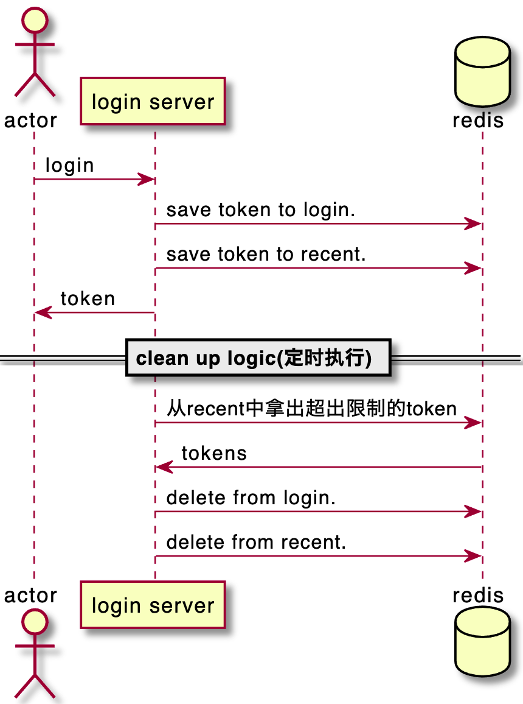
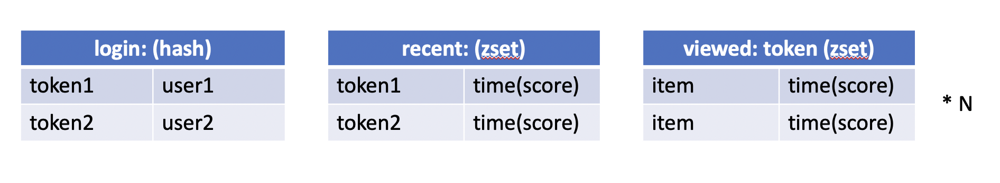
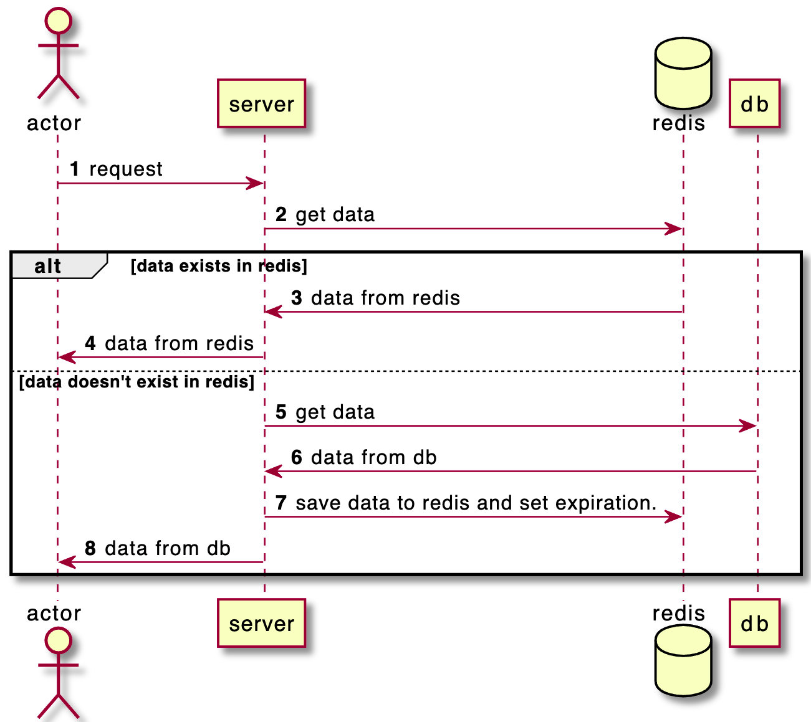

- [Redis In Action读书笔记](#redis-in-action读书笔记)
  - [应用场景](#应用场景)
    - [排行榜](#排行榜)
    - [2.1. Login And Cookie Caching](#21-login-and-cookie-caching)
    - [2.2. Shopping Carts In Redis](#22-shopping-carts-in-redis)
    - [2.3. Web Page Caching](#23-web-page-caching)
    - [2.4. Database Row Caching](#24-database-row-caching)
  - [Memo](#memo)
# Redis In Action读书笔记
## 应用场景
### 排行榜
类似于各种论坛的高票回答排行，高阅览量排行

### 2.1. Login And Cookie Caching
大体的逻辑架构：

Reids的结构：

redis选用的数据结构还是蛮有意思的。  
存储login token的信息用的是hash。  
而用记录最近登录用户信息的结构是sorted set。  

一点自己的感想：  
redis作为token的缓存确实在合适不过。  
因为，每条request都应该检测账号是否登录。  
如果用传统的db，io的读写会占用大量的时间。  
但是，Redis是存储在memory上的，因此，开销要小的多。  
而且，存在redis上token即使不持久化也没有问题。  
因为，即使信息丢失，让用户再次登录一次即可。

### 2.2. Shopping Carts In Redis

### 2.3. Web Page Caching
### 2.4. Database Row Caching
2.3和2.4比较相似。基本可以用下面的序列图概括思想。  
2.4节书中给出的例子是使用cron，定时将db的数据写到redis里面，以此达到无需去db取数据的效果。

一点自己的感想：  
对实时性要求比较高的功能，并不适合做缓存，因为，要考虑redis和db间的数据同步问题。  
例如序列图2，3处，如果，缓存设置的时间过长，那可能会造成db的数据更新后，不能及时反映给客户端（因为，只有缓存失效后，才会去db取最新的数据）。

## Memo
1. 应用Redis的场景中，最重要的一点就是实时性(real time)。
2. set和hash在Redis中的区别。set是key: value, value, value。hash是key: (key, value), (key, value), (key, value)。