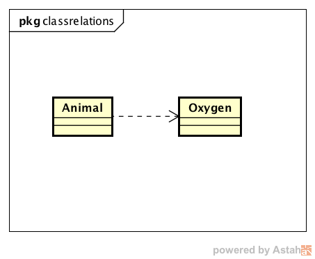
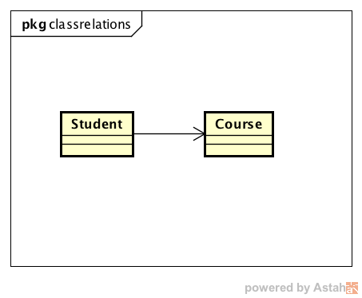
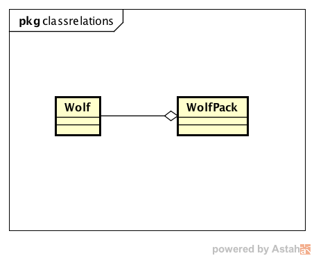
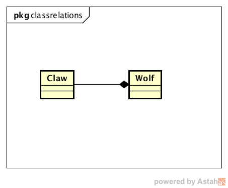
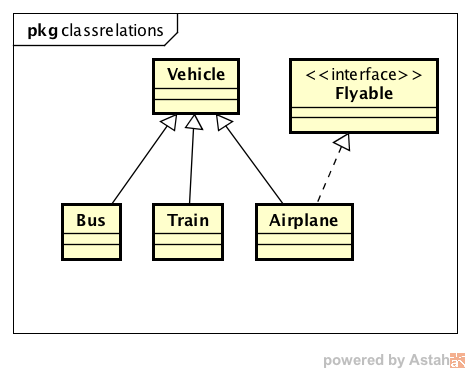

# 类与类之间的关系
**keywords: UML，类关系，依赖，关联，聚合，组合，泛化**  
* [UML中类的五类关系](#overview)
  + [依赖关系](#dependency)
  + [关联关系](#association)
  + [聚合关系](#aggregation)
  + [组合关系](#composition)
  + [泛化关系](#generalization)
* [学术定义与工业定义的不同](#difference)
* [参考](#reference)

## <a name="overview"></a>UML中类的五类关系
UML中类的五类关系可以分为：依赖、关联、聚合、组合、泛化/实现。  
他们之间的耦合性强度为：依赖 < 关联 < 聚合 < 组合 < 泛化/实现  

### <a name="dependency"></a>依赖关系（Dependency）
* 依赖关系是一种使用关系，即一个类的中使用到了另一个类。  

* UML类图表现为虚线和指向被依赖类的箭头。  
  

* 代码表现：  
  ```  
  public class Animal {
      public Animal() { }
  }  

  public class Oxygen {
      public Oxygen() { }
  }  
  ```
  首先我们需要注意在定义的两个类中，成员变量和构造方法中都没有互相引用，即Animal类和Oxygen类之间没有直接关联。

  1.在Animal的某个方法中使用Oxygen的静态方法：  
  ```  
  public class Animal {
      public Animal() { }
      public void breathe() {
          Oxygen.oxidize();
      }
  }
  ```
  2.在Animal的某个方法中以局部变量的形式使用Oxygen:  
  ```  
  public class Animal {
      public Animal() { }
      public void breathe() {
          Oxygen oxygen = new Oxygen();
      }
  }
  ```
  3.在Animal的某个方法中以函数参数或者函数返回值的形式使用Oxygen:  
  ```  
  public class Animal {
      public Animal() { }
      public void breathe(Oxygen oxygen) { }
  }
  ```
  我们可以注意到依赖关系是一种使用关系，而不是一种拥有关系，这尤其可以在Oxygen（被依赖类）的生命周期中得到体现，Oxygen的生命周期与调用它的方法的生命周期相同，在调用它的方法结束时，Oxygen的生命周期也会结束。  


### <a name="association"></a>关联关系（Association）
* 关联关系是一种拥有关系，表示一个类可以直接获取另一个类的信息（属性和方法）。  

* UML表示为实线和箭头。用实线也表示了关联的耦合性要强于依赖。  
  

* 代码表现：  
  ```  
  public class Student {
      Course[] courses;
      public Student() { }
  }
  ```
  可以看到，Student类拥有Course类型的成员变量，与没有持有另一个类的属性的依赖关系相比，关联关系是一种耦合性更高的关系。  
  而从生命周期的角度也可以发现，关联关系中Course（被关联类）的生命周期，由实例化开始，到Student类的生命周期结束为止，即关联关系拥有更长的生命周期。  


### <a name="aggregation"></a>聚合关系（Aggregation）
* 聚合关系是整体与部分的关系，且部分可以独立于整体而存在。  

* UML表示为实线和空的菱形箭头。
    

* 代码表现：  
    ```  
    public class WolfPack {
        List<Wolf> wolves = new LinkedList<Wolf>();

        public WolfPack(Wolf wolf) {
            wolves.add(wolf);
        }
    }
    ```
  可以看到狼群类（WolfPack）和狼类（Wolf）就是聚合关系。狼群类的构造方法接受狼的实例，因此，狼可以独立于狼群存在，不随这狼群的生命周期结束而结束。  


### <a name="composition"></a>组合关系（Composition）
* 组合关系也是整体与部分的关系，但是部分不能离开整体独立存在。  

* UML表示为实线和实心的菱形箭头。
    

* 代码表现：  
  ```  
  public class Wolf {
      Claw claw;

      public Wolf() {
          this.claw = new Claw();
      }
  }
  ```
  可以看到组合关系中，狼爪在狼的构造函数中实例化，并且有没有提供其他可以接受狼爪的实例化的方法，因此，狼爪的生命周期与狼相同。  
  从数据封装的角度看，对于组合关系，外部只知道有狼这一实例，但是，狼内部有狼爪这一实例并不知晓。但是，聚合关系则不同，外部不仅知道狼群实例的存在，也知道狼的实例的存在。  
  从以上两点可以看出，组合关系的耦合度比聚合关系更高。  


### <a name="composition"></a>泛化关系（Generalization）
* 泛化表示一种特殊与一般的关系，在代码中变现为继承与实现。由于这两点大家一定都非常熟悉，所以，不在赘述。  

* 继承的UML表现为实线和三角箭头，实现的UML变现为虚线和三角箭头。由此可见，实现的耦合度要低于继承，这也是为什么现在都提倡面向接口编程，以及都说接口编程可复用性和可拓展性高的原因。  
  

## <a name="difference"></a>学术定义与工业定义的不同
在学习以上五类关系的过程中，我特意查了UML创始人所著的书“Object-Oriented Analysis And Design With Applications”，其中，关于聚合和组合的定义，貌似与实际应用的定义完全相反。我只贴出了原书关于组合部分的说明，感兴趣的朋友可以查下我参考中给出的出处，如有问题可以再深入再探讨。
> A less direct kind of aggregation is also possible, called composition, which is containment by reference. In this case, the class TemperatureController still denotes the whole, and an instance of the class Heater is still one of its parts, although that part must now be accessed indirectly. Hence, the lifetimes of these two objects are not so tightly coupled as before: We may create and destroy instances of each class independently.  

## <a name="reference"></a>参考  
[1] Object-Oriented Analysis And Design With Applications Third Edition. Grady Booch etc. P110  
[2] 面向对象分析与设计（第3版），Grady Booch等著，王海鹏等译，P78
