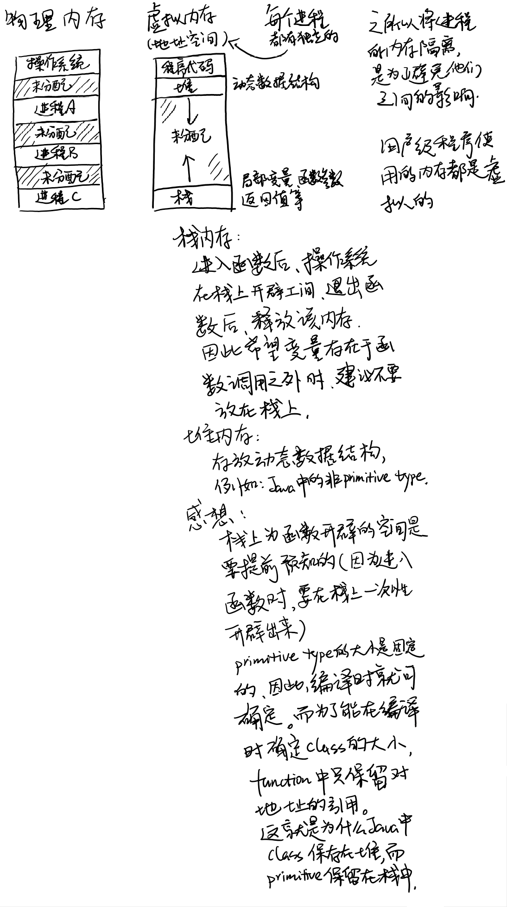

- [操作系统-进程-多线程](#操作系统-进程-多线程)
  - [操作系统的CPU的虚拟化](#操作系统的cpu的虚拟化)
    - [Time Sharing模式](#time-sharing模式)
    - [程序与进程的区别](#程序与进程的区别)
  - [操作系统的内存虚拟化](#操作系统的内存虚拟化)
    - [Java虚拟机](#java虚拟机)
  - [并发](#并发)
  - [Reference](#reference)
# 操作系统-进程-多线程
## 操作系统的CPU的虚拟化
### Time Sharing模式
这算是老生常谈的内容了，操作系统会把CPU资源分成许多个时间片，每个时间片都给一个进程使用，虽然，每个进程都是按顺序在时间片上运行，但是由于时间片很小，所以从人的角度看，相当于1秒钟的时间里，多个进程在同时运行。

### 程序与进程的区别
程序是静态的。而进程是指程序在cpu以及内存上运行的状态，也就是正在运行的程序。所以，进程不仅涵盖代码，还包含执行程序所需要的资源。

## 操作系统的内存虚拟化

为了让多个程序可以同时运行，每个程序应当有自己独立的内存空间，且互相不受影响。  
因此，现在操作系统引入了虚拟内存（地址空间）的概念。每个进程有自己独立的虚拟内存，每个虚拟内存与物理内存之间可以相互映射。  
程序被读入内存后，放置在虚拟内存的最上端，最下端为栈。  
函数内的局部变量，函数参数，返回值，返回地址都存在栈中。  
进入函数时，栈上会为函数一次性开辟函数所需要的内存空间，函数返回时，该空间会被释放。  
而动态的数据结构，例如class都是运行时在堆上动态分配。  

### Java虚拟机
理解操作系统的虚拟内存后，也基本可以理解为什么Java虚拟机只将primitive type分配到栈上，而其他的class都分配到堆上了。  
因为，每次执行函数前，内存栈上都需要给函数分配空间，而动态的class没法提前计算空间。因此，为了能准确的计算函数所需要的内存空间，函数上的class只保留指向堆的地址，这个地址的大小是固定的，这样编译器就可以在编译的时候知道每个函数的准确空间。而Class只要运行时，在堆上动态分配后，将地址填入函数中即可。  
这就是为什么操作系统和Java虚拟机都是将primitive type分配到栈上，class分配到堆上的原因了。

## 并发
随着计算机的发展，逐渐出现需要进程内部同时处理多个任务的需求，因此，线程的概念也被引入进来。  
线程与进程最大的区别就是，线程没有独立的内存空间，均是使用进程的共享空间（每个函数有自己独立的栈，没有独立的堆）。  
因此，多线程开发中，给共享资源加锁就变得尤为重要。  
由于线程共享进程内的内存，因此，线程间的数据共享变得简单。  
而且，多线程运行也无需像多进程运行那样切换上下文，所以，多个任务多个线程运行的开销要比多个任务多个进程同时运行的开销少的多。

## Reference
操作系统导论（Operating Systems: Three Easy Pieces）https://pages.cs.wisc.edu/~remzi/OSTEP/