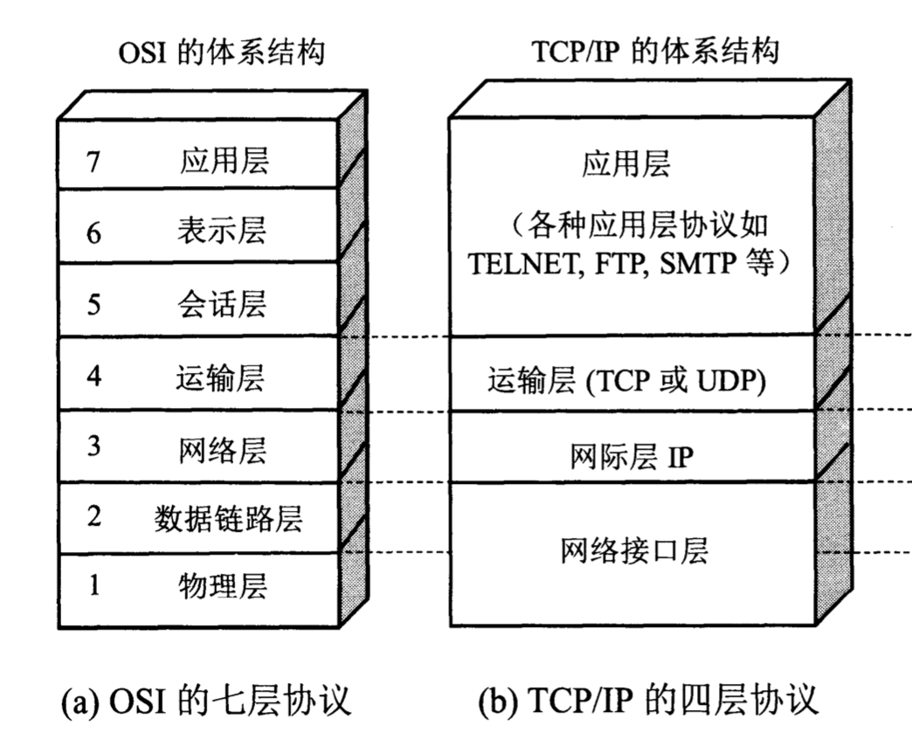
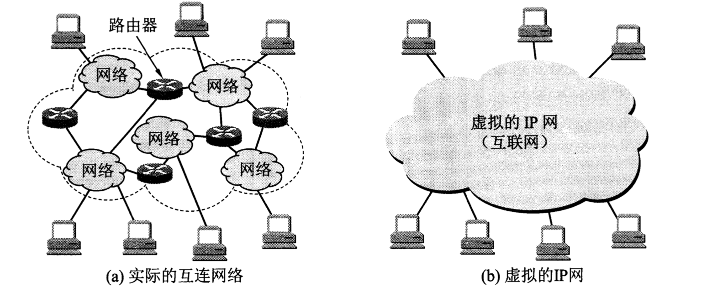

# 计算机网络
## 网络体系结构
* OSI (Open System Interconnection Refernce Model 开放系统互连基本参考模型):  
  常说的7层模型。就是一个标准，用于定义不同系统间如何通信。
* TCP/IP:   
  与OSI完全一样，也是通信标准，虽然，并非法律上的国际标准，  
  但是，市场份额最多，使用最广泛，所以，是事实上的国际标准。  
  TCP/IP是4层结构。

在体系标准之下，每层又会有具体的协议，用于实现真正的通信功能。  
例如：应用层的FTP或HTTP协议。运输层的TCP或UDP协议。网际层的IP协议等。

* 应用层: 进程间的交互完成特定网络应用。
* 运输层: 为两台主机中的进程提供通用的数据传输服务。
* 网际层: 1. 分组交换网上的不同主机提供通信服务。2. 寻找合适的路由传输数据。
* 数据链路层: 定义链路上如何传输数据。（网线上如何传输数据。）

## 网络层
IP协议可以将通过路由链接的不同网络统一成虚拟的互联网。这个虚拟的互联网在网络层上看起来好像是一个统一的网络。

路由器用于链接两个不同的网络，因此，至少应该有两个IP，以家用路由器为例，路由器有内网IP（内网IP：192.168.1.1）和外网IP（真实IP），以此，可以联通内网和外网。
## 运输层
## 应用层
## 网络安全
* 数据加密模型
* 密码体制
* 数字签名
## 音频，视频服务