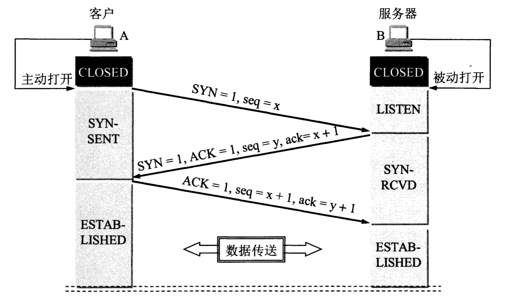
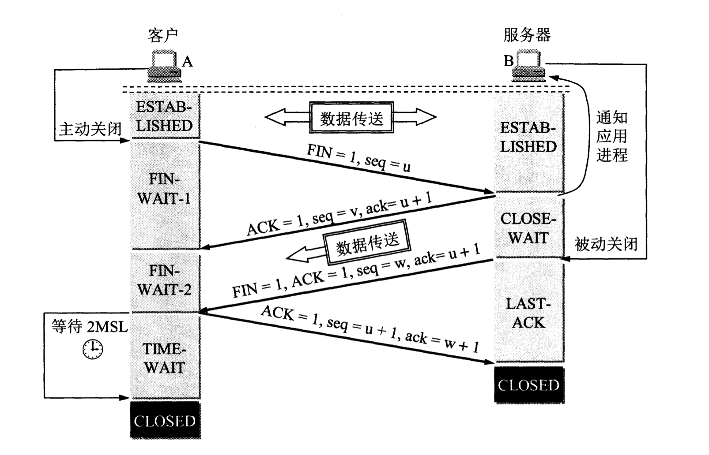

- [计算机网络](#计算机网络)
  - [网络体系结构](#网络体系结构)
  - [网络层](#网络层)
    - [划分子网](#划分子网)
    - [无分类编址CIDR](#无分类编址cidr)
  - [运输层](#运输层)
    - [TCP的链接](#tcp的链接)
    - [TCP建立连接(三次握手)](#tcp建立连接三次握手)
    - [TCP释放连接(四次握手)](#tcp释放连接四次握手)
  - [应用层](#应用层)
  - [网络安全](#网络安全)
    - [密码体制](#密码体制)
    - [数字签名](#数字签名)
  - [音频，视频服务](#音频视频服务)
    - [流式存储音频，视频](#流式存储音频视频)
    - [流式实况音频，视频](#流式实况音频视频)
    - [交互式音频，视频](#交互式音频视频)
# 计算机网络
## 网络体系结构
* OSI (Open System Interconnection Refernce Model 开放系统互连基本参考模型):  
  常说的7层模型。就是一个标准，用于定义不同系统间如何通信。
* TCP/IP:   
  与OSI完全一样，也是通信标准，虽然，并非法律上的国际标准，  
  但是，市场份额最多，使用最广泛，所以，是事实上的国际标准。  
  TCP/IP是4层结构。


在体系标准之下，每层又会有具体的协议，用于实现真正的通信功能。  
例如：应用层的FTP或HTTP协议。运输层的TCP或UDP协议。网际层的IP协议等。

* 应用层: 进程间的交互完成特定网络应用。
* 运输层: 为两台主机中的**进程**提供通信。
* 网际层:  
  1. 分组交换网上的不同**主机**提供通信服务（定位主机）。
  2. 寻找合适的路由传输数据（找路）。
* 数据链路层: 定义**链路**上如何传输数据。（网线上如何传输数据。）

## 网络层
IP协议可以将通过路由链接的不同网络统一成虚拟的互联网。这个虚拟的互联网在网络层上看起来好像是一个统一的网络。  
没有IP协议，只能通过物理地址mac码进行定位，而mac码无法实现子网的概念，因此，无法形成统一的虚拟互联网。

路由器用于链接两个不同的网络，因此，至少应该有两个IP，以家用路由器为例，路由器有内网IP（内网IP：192.168.1.1）和外网IP（真实IP），以此，可以联通内网和外网。
### 划分子网
* 子网  
属于某个网络的内部划分，与外界无关。从外界看，划分子网后的网络仍是一个网络。
* 子网掩码  
用于划分子网。因为，ip的组成为<网络号><主机号>。所以，从路由器的角度看，无法直接通过ip知道子网。因此，引入子网掩码的概念。  
例如，网络号145.3.0.0，子网为145.3.x.0。单从ip无法区别。  
但是，引入掩码255.255.255.0，就可以通过网络号和掩码的and操作，得到145.3.255.0，因此可知子网为145.3.x.0。

### 无分类编址CIDR
将原有的ip地址，分为前缀码和主机码，`/`后为前缀码位数。

## 运输层
运输层主要在进程间提供通信服务，定位主机上的哪个进程应该收发信息。  
定位主机使用的是IP（网络层的ip协议），而定位主机上的特定应用进程，就需要端口号（运输层的TCP或UDP协议）。  
客户端向服务器发送请求时，会从49152~65535中动态生成一个端口号。然后，客户端进程会通过该端口向服务器发送请求，服务器收到请求后会返回数据。通信结束后，客户端的端口号会被释放，然后，这个端口号可被其他进程再次使用。

### TCP的链接
TCP链接的端点叫做socket。socket根据TCP协议由IP地址和端口组成。
```
socket = (ip: port) = 192.168.1.101:80  
```
TCP的链接可定义为：
```
tcp connection = {socket1, socket2} = {(ip1: port1), (ip2: port2)}
```

### TCP建立连接(三次握手)

进行第三次握手的原因：  
如果A不向B再次确认，有可能出现第二次回信丢失，然后B建立了连接，A由于没有收到回信，因此，没有启动连接。这样B的链接永远不会被释放，很多资源会被浪费。
  
### TCP释放连接(四次握手)

之所以有fin-wait-2阶段，是因为在发起关闭请求之前，可能会有一些滞留的请求没有被服务器响应完成，因此设置了fin-wait-2阶段。此阶段A到B的链接已经关闭。  
当服务器端确认数据已经全部响应完成后，会向A发送关闭请求关闭B到A方向上的链接。  
time-wait阶段是因为，要保证B能百分百接到第四次握手，如果，第四次握手B迟迟没有收到的话，B会向A再次发送第三次握手的关闭链接请求。如果没有time-wait阶段，而是，直接关闭链接，那B向A的重发请求，A无法接到，这样B就永远无法释放链接了。

## 应用层
## 网络安全
### 密码体制
公钥密码体制（RSA）。  
生成一对秘钥。公钥用于加密，秘钥用于解密。  
公钥可以共享，秘钥存入想要通信的服务器。  
这样就可以实现多对一加密通信。  
例如，平时用github上传代码，自己的电脑存放公钥，github服务器存放秘钥。  
这样通信的时候，自己向github推送的代码是加密的。  
而github不会向我们发送数据，因此，无需加密，只要能解密即可。
### 数字签名

## 音频，视频服务
### 流式存储音频，视频
音频和视频存储在服务器，然后，边看边播到本地。
### 流式实况音频，视频
典型的就是直播，从模拟信号转成数字信号，然后，发给用户。
### 交互式音频，视频
语音电话，视频电话。